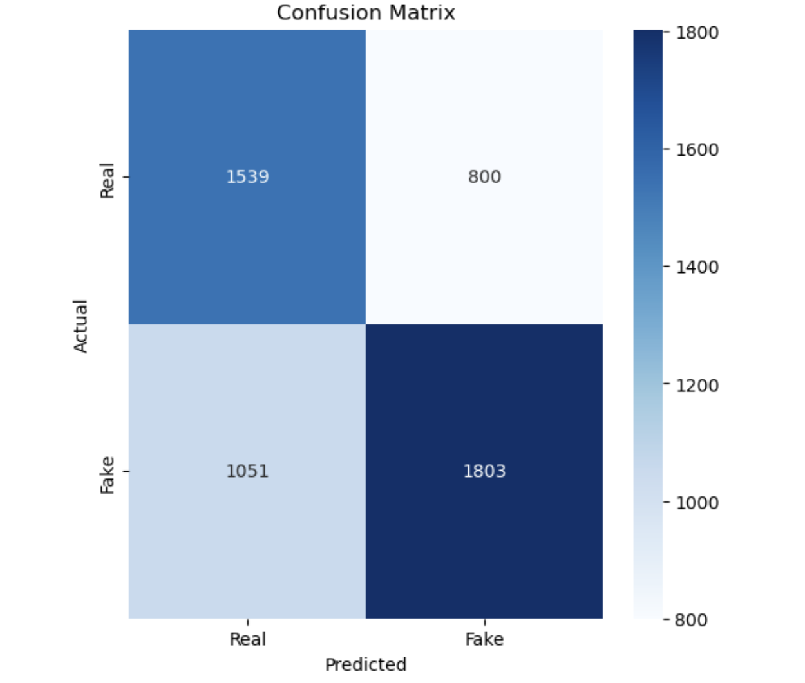

# fake-news-detection
Fake News Detection Using Logistic Regression and TF-IDF Features

This project focuses on detecting fake news using machine learning techniques, specifically **Logistic Regression** with TF-IDF features and Word Embeddings. The goal is to classify news articles as either **Fake** or **Real** based on their content.

---

**Project Overview**
In this project:
- I preprocess the text data using techniques like stopword removal and lemmatization.
- I use **TF-IDF vectorization** to represent the text as numerical features.
- I train and evaluate a **Logistic Regression** model on a dataset of labeled news articles.
- I visualize model performance using metrics like the confusion matrix and ROC-AUC.

---

**Features**
- **Text Preprocessing**:
  - Cleaned text data by removing stopwords and lemmatizing words.
  - Represented text data using **TF-IDF vectorization** and **GloVe embeddings** for semantic understanding.
- **Machine Learning**:
  - Trained a **Logistic Regression** model to classify Fake vs. Real news.
  - Optimized hyperparameters using **GridSearchCV**.
- **Performance Metrics**:
  - Evaluated accuracy, precision, recall, F1-score, and ROC-AUC.
  - Generated visualizations like confusion matrix and ROC curve.

---

**Dataset**
The dataset used for this project is from [Kaggle Fake News Dataset](https://www.kaggle.com/c/fake-news/data). It contains:
- **Train Data**: News articles labeled as `Fake` or `Real`.
- **Test Data**: Unlabeled data for evaluation.
- **Submit Data**: Labeles for the unlabeled test data.


---

**Results**
- **Accuracy**: 64% on the test set.
- **ROC-AUC**: 0.68
- **Precision/Recall/F1-score**:
  - Fake News Class:
    - Precision: 0.69
    - Recall: 0.63
    - F1-score: 0.66
  - Real News Class:
    - Precision: 0.59
    - Recall: 0.66
    - F1-score: 0.6

**Visualizations:**
1. **Confusion Matrix**:
   

2. **ROC Curve**:
   

3. **Metrics**:
   

---

**Installation**
Follow these steps to set up and run the project locally:

1. **Clone the Repository**:
   ```bash
   git clone https://github.com/nouuurrr/fake-news-detection.git
   cd fake-news-detection
